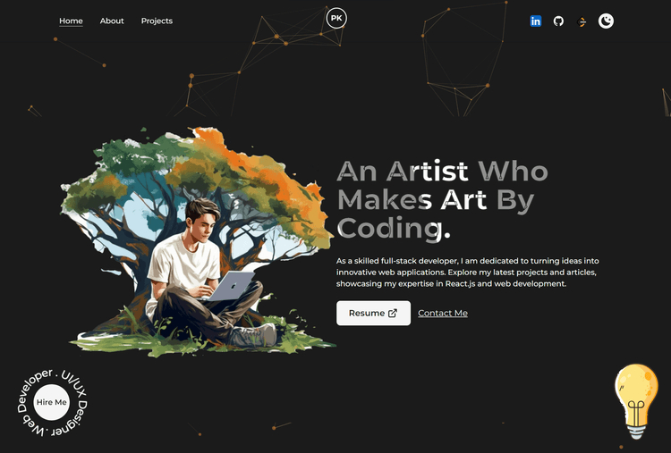
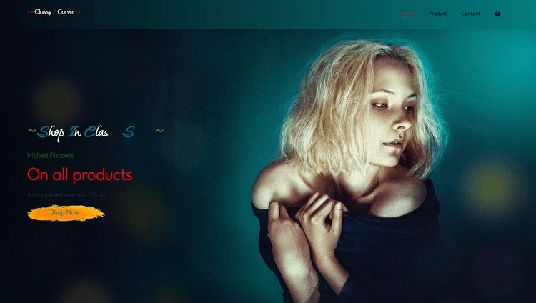
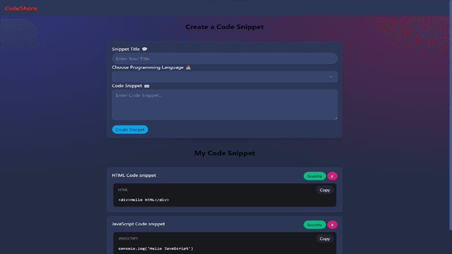

<h1 align="center">Hi 👋, I'm Prashant Kumar</h1>
<h3 align="center">My work lives in a digital environment and is nurtured by the love of designing and developing. By combining my creativity and skills I create interactive pages and add a life for websites. I draw my inspiration from the madness of daily designing and building it going through on contemporary bugs and everlasting love for developing.</h3>

  

- 🔭 I’m currently working on **Mern Stack Website**

- 🌱 I’m currently learning **Node Js**

- 👯 I’m looking to collaborate on **C++, Front-end web development, DSA**

- 💬 Ask me about **C++, Frontend Development , DSA**

- 📫 How to reach me **prashantkry745@gmail.com**

- ⚡ Fun fact **I like Movie based on hacking and web site making**

<h3 align="left">Connect with me:</h3>

<h3 align="left">Languages and Tools:</h3>

                

<h3 align="left">Projects</h3>

| [Portfolio](https://github.com/Prashantkry/Prashant-Portfolio)  | [E-Commerce Website](https://github.com/Prashantkry/BookSto)|
| :--------------------------:       | :-------------------------: |
|                |   |
| [classyCurve](https://github.com/Prashantkry/Classy-Curve) | [codeSnippet](https://github.com/Prashantkry/Code-Snippet-Creator) |
|  |  |

&nbsp;

